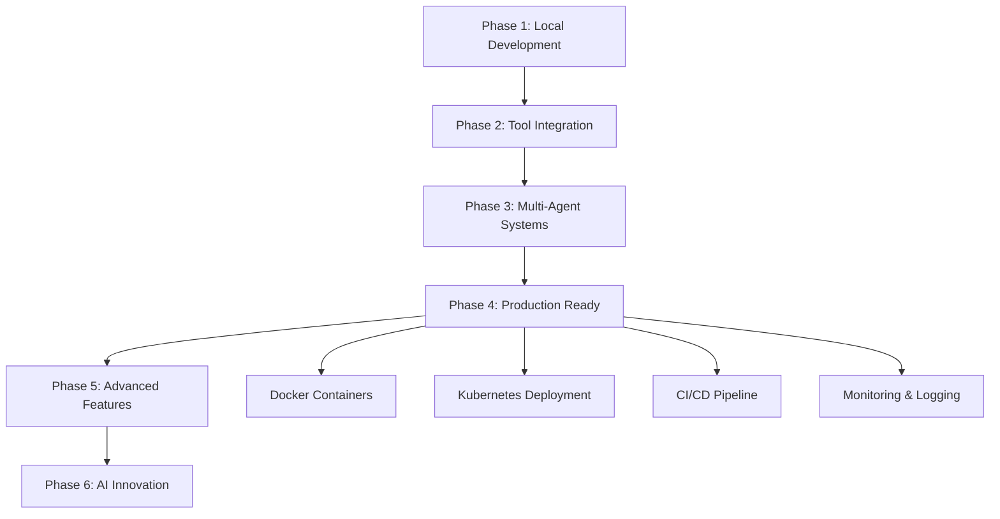

# Project Roadmap 🗺️

This document outlines the development roadmap for the Multi-Agent Travel Assistant System, showing completed milestones and future plans.

## 🎯 Project Vision

Build a comprehensive multi-agent AI system that progressively teaches developers how to create sophisticated AI assistants, culminating in a production-ready travel planning platform.

## ✅ Completed Phases

### Phase 1: Foundation (Beginner) ✅
**Status**: Complete  
**Completion Date**: Current  

**Objectives**:
- Introduce basic agent concepts
- Demonstrate rule-based systems
- Show prompt engineering fundamentals

**Deliverables**:
- ✅ `RuleBasedTravelAdvisor` - Decision-making without AI
- ✅ `PromptBasedTravelAgent` - Basic LLM integration
- ✅ Interactive CLI interfaces
- ✅ Basic error handling
- ✅ Configuration management

**Key Learning Outcomes**:
- Understanding agent architecture
- Prompt engineering basics
- OpenAI API integration
- Input validation and error handling

### Phase 2: Tool Integration (Intermediate) ✅
**Status**: Complete  
**Completion Date**: Current  

**Objectives**:
- Add external tool capabilities
- Implement memory systems
- Handle async operations

**Deliverables**:
- ✅ `ToolUsingAgent` with external API integration
- ✅ Weather, Flight, and Hotel search tools
- ✅ Memory systems (Vector, Conversation, Preferences)
- ✅ Async tool execution
- ✅ Error handling and retries

**Key Learning Outcomes**:
- Function calling with LLMs
- External API integration
- Memory system design
- Async programming patterns

### Phase 3: Multi-Agent Systems (Advanced) ✅
**Status**: Complete  
**Completion Date**: Current  

**Objectives**:
- Create specialized agent roles
- Implement agent coordination
- Build complex workflows

**Deliverables**:
- ✅ `CoordinatorAgent` for task orchestration
- ✅ Specialist agents (Flight, Hotel, Budget, Weather)
- ✅ Inter-agent messaging system
- ✅ Task delegation and coordination
- ✅ Complex travel planning workflows

**Key Learning Outcomes**:
- Multi-agent architecture
- Agent coordination patterns
- Message passing systems
- Complex workflow management

## 🚧 Phase 4: Production Systems (Expert) - Coming Soon

**Status**: Planning/Development  
**Target Completion**: Q2 2024  

**Objectives**:
- Production-ready deployment
- Advanced AI capabilities
- Scalable architecture

**Planned Deliverables**:
- 🔄 Auto-agent loops and self-improvement
- 🔄 RAG (Retrieval Augmented Generation) system
- 🔄 Production deployment configurations
- 🔄 Monitoring and observability
- 🔄 User authentication and session management
- 🔄 Database persistence
- 🔄 Web-based user interface
- 🔄 API rate limiting and caching

**Key Learning Outcomes**:
- Production deployment strategies
- Monitoring and observability
- Scalability considerations
- Security best practices

### Phase 4.1: Auto-Agent Loops
**Target**: Month 1-2

**Features**:
- Self-improving agents that learn from interactions
- Automatic tool discovery and integration
- Dynamic prompt optimization
- Performance monitoring and adjustment

**Implementation**:
```python
class SelfImprovingAgent(BaseAgent):
    async def improve_from_feedback(self, feedback: UserFeedback):
        """Learn and adapt from user feedback"""
        pass
    
    async def discover_new_tools(self, capability_gap: str):
        """Automatically find and integrate new tools"""
        pass
```

### Phase 4.2: RAG Knowledge Base
**Target**: Month 2-3

**Features**:
- Comprehensive travel knowledge base
- Semantic search capabilities
- Real-time knowledge updates
- Personalized recommendations

**Implementation**:
```python
class RAGTravelAgent(BaseAgent):
    def __init__(self):
        self.knowledge_base = TravelKnowledgeBase()
        self.retriever = SemanticRetriever()
    
    async def get_context_aware_response(self, query: str):
        """Generate responses using retrieved knowledge"""
        pass
```

### Phase 4.3: Production Deployment
**Target**: Month 3-4

**Features**:
- Docker containerization
- Kubernetes orchestration
- CI/CD pipelines
- Load balancing and auto-scaling

**Implementation**:
- Docker containers for each service
- Kubernetes deployment manifests
- GitHub Actions CI/CD
- Monitoring with Prometheus/Grafana

## 🔮 Future Enhancements (Post-Phase 4)

### Phase 5: Advanced Features
**Target**: Q3-Q4 2024

**Planned Features**:
- 🔮 Voice interface integration
- 🔮 Mobile app development
- 🔮 Real-time collaboration features
- 🔮 Integration with booking platforms
- 🔮 AR/VR travel previews
- 🔮 Social travel planning features

### Phase 6: AI Innovation
**Target**: 2025

**Research Areas**:
- 🔮 Custom model fine-tuning
- 🔮 Multimodal AI integration (images, video)
- 🔮 Predictive travel analytics
- 🔮 Advanced personalization algorithms
- 🔮 Cross-cultural communication features

## 📊 Development Metrics

### Current Stats (Phase 1-3)
- **Lines of Code**: ~2,500
- **Test Coverage**: 0% (TBD)
- **API Integrations**: 4 (OpenAI, Weather, Mock Flight/Hotel)
- **Agent Types**: 8
- **Tool Implementations**: 6
- **Memory Systems**: 3

### Phase 4 Targets
- **Test Coverage**: 80%+
- **API Response Time**: <2 seconds
- **Concurrent Users**: 100+
- **Uptime**: 99.9%
- **Documentation Coverage**: 100%

## 🛠️ Technical Roadmap

### Infrastructure Evolution



### Architecture Evolution

**Current Architecture (Phase 3)**:
```
Local Environment
├── Rule-based Agents
├── Prompt-based Agents
├── Tool-using Agents
├── Multi-agent Coordinator
├── Memory Systems
└── External APIs
```

**Target Architecture (Phase 4)**:
```
Cloud-Native Platform
├── API Gateway
├── Authentication Service
├── Agent Orchestration Service
├── Knowledge Base (RAG)
├── Memory & Persistence Layer
├── External Integration Hub
├── Monitoring & Analytics
└── Web/Mobile Interfaces
```

## 🎯 Learning Path Recommendations

### For Beginners
1. Start with Phase 1 - Rule-based systems
2. Understand prompt engineering
3. Learn OpenAI API basics
4. Practice with simple tools

### For Intermediate Developers
1. Focus on Phase 2 - Tool integration
2. Learn async programming
3. Understand memory systems
4. Practice API integrations

### For Advanced Developers
1. Master Phase 3 - Multi-agent systems
2. Learn coordination patterns
3. Build complex workflows
4. Prepare for Phase 4 production concepts

### For Production Engineers
1. Study Phase 4 planning
2. Learn deployment strategies
3. Understand monitoring requirements
4. Plan scalability considerations

## 📅 Timeline

### Q1 2024 (Current)
- ✅ Complete Phases 1-3
- ✅ Documentation and setup automation
- ✅ Basic testing framework
- 🔄 Community feedback integration

### Q2 2024
- 🔄 Phase 4.1: Auto-agent loops
- 🔄 Phase 4.2: RAG implementation
- 🔄 Phase 4.3: Production deployment
- 🔄 Comprehensive testing suite

### Q3 2024
- 🔮 Phase 5: Advanced features
- 🔮 Mobile app development
- 🔮 Voice interface integration
- 🔮 Real booking integrations

### Q4 2024
- 🔮 Performance optimization
- 🔮 Advanced analytics
- 🔮 Enterprise features
- 🔮 Phase 6 planning

## 🤝 Community Involvement

### Contribution Opportunities
- **Beginners**: Documentation, examples, tutorials
- **Intermediate**: Tool implementations, testing
- **Advanced**: Agent architectures, optimization
- **Experts**: Production deployment, monitoring

### Open Source Roadmap
- Open source core components
- Community-driven tool ecosystem
- Plugin architecture for extensions
- Educational content creation

## 📈 Success Metrics

### Educational Goals
- Help 1000+ developers learn AI agent development
- Create comprehensive learning resources
- Build active community of contributors
- Establish best practices for multi-agent systems

### Technical Goals
- Production-ready deployment capability
- 99.9% uptime for hosted services
- Sub-2-second response times
- Support for 1000+ concurrent users

### Business Goals
- Demonstrate commercial viability
- Attract enterprise partnerships
- Enable real travel booking integration
- Create sustainable development model

---

## 📞 Get Involved

Want to contribute to the roadmap? Here's how:

1. **Feedback**: Share your thoughts on feature priorities
2. **Development**: Contribute code for upcoming phases
3. **Testing**: Help test new features and report issues
4. **Documentation**: Improve guides and tutorials
5. **Community**: Help other developers learn and grow

**Contact**: Open an issue on GitHub or join our community discussions!

---

*This roadmap is a living document and will be updated based on community feedback and technological advances.* 🚀
